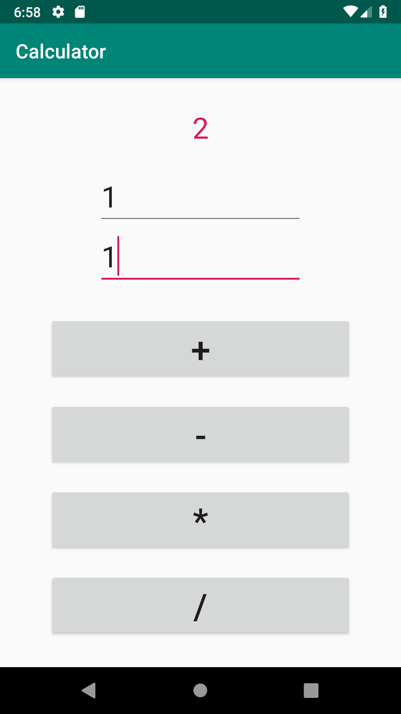
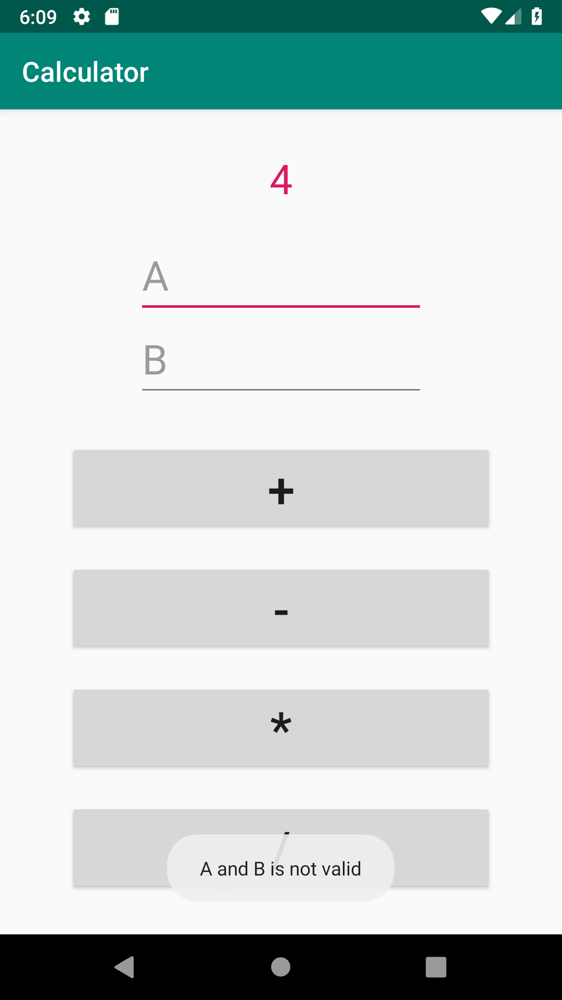
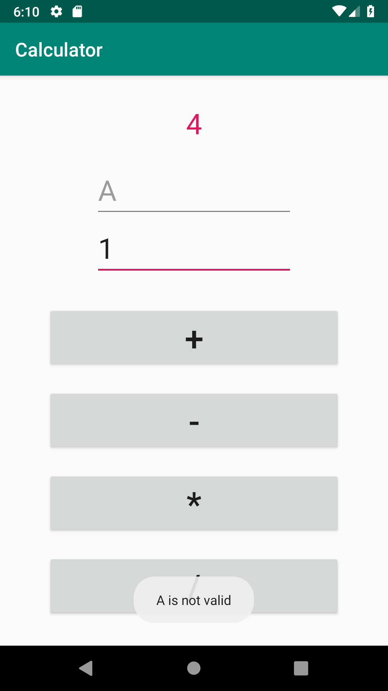
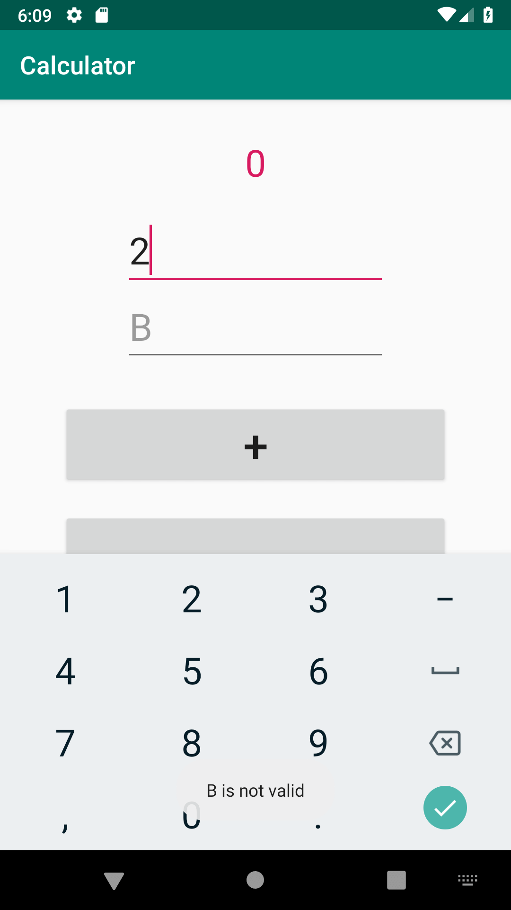

# Simple Calculator

|  수업명  | 응용프로그래밍             |
| :---: | ------------------- |
|  교수   | 안진현                 |
|  과제   | 계산기 레이아웃 설계 및 기능 구현 |

## Screenshots

|          `1+1`           |    A and B is Empty     |       A is Empty       |       B is Empty       |
| :----------------------: | :---------------------: | :--------------------: | :--------------------: |
|  |  |  |  |

## License

_simple-calculator_ is primarily distributed under the terms of the MIT License. see [LICENSE](./LICENSE) for details.
